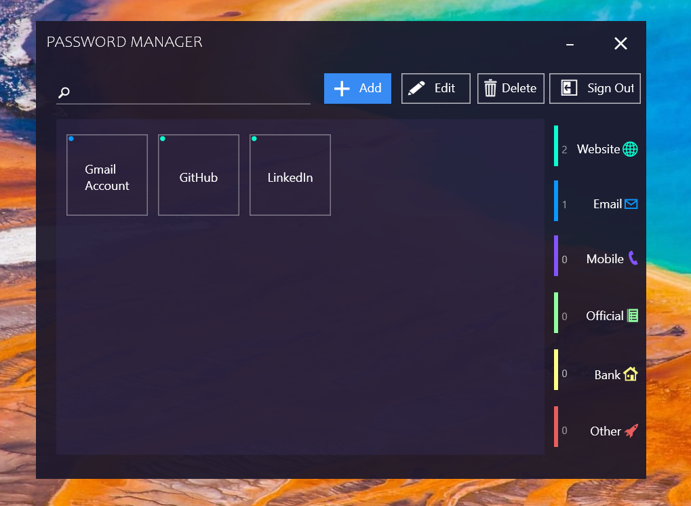

This is one of my personal project, featuring a fully functional Password Manager for desktop.

Made using C#, WPF and SQL, Password Manager allows the user to store, edit and manage their passwords and other useful information. The app features a wide range of tools, and also a number of categories under which the user can store their passwords.

The User Interface is made with care to be modern and stylish but also to be easy to use and intuitive.

Here's a preview of the app, showing some of it's features:

HOW TO USE THE APP: Note: The software is still in the development process, so you might encounter bugs and errors.

Install the .exe file provided with the files.
Now you will have to create a user account, which would be saved in your computer (with security)
Now you can use the app to save and manage passwords.

Note: I've removed the app from github due to some bugs, which I might have to work later on.

Thank you. You can contact me at: mohdzish2000@gmail.com
